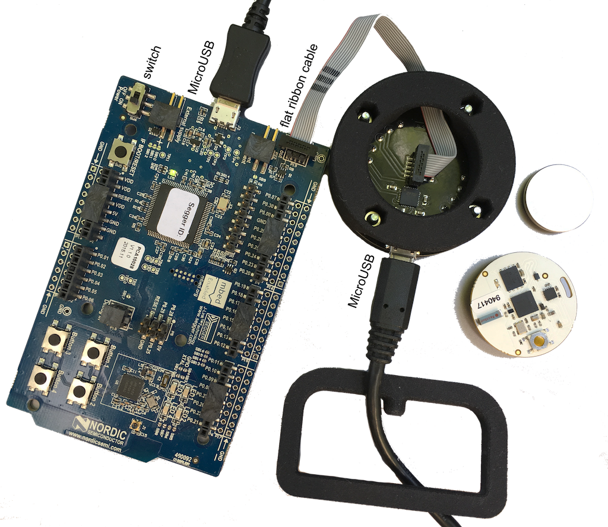
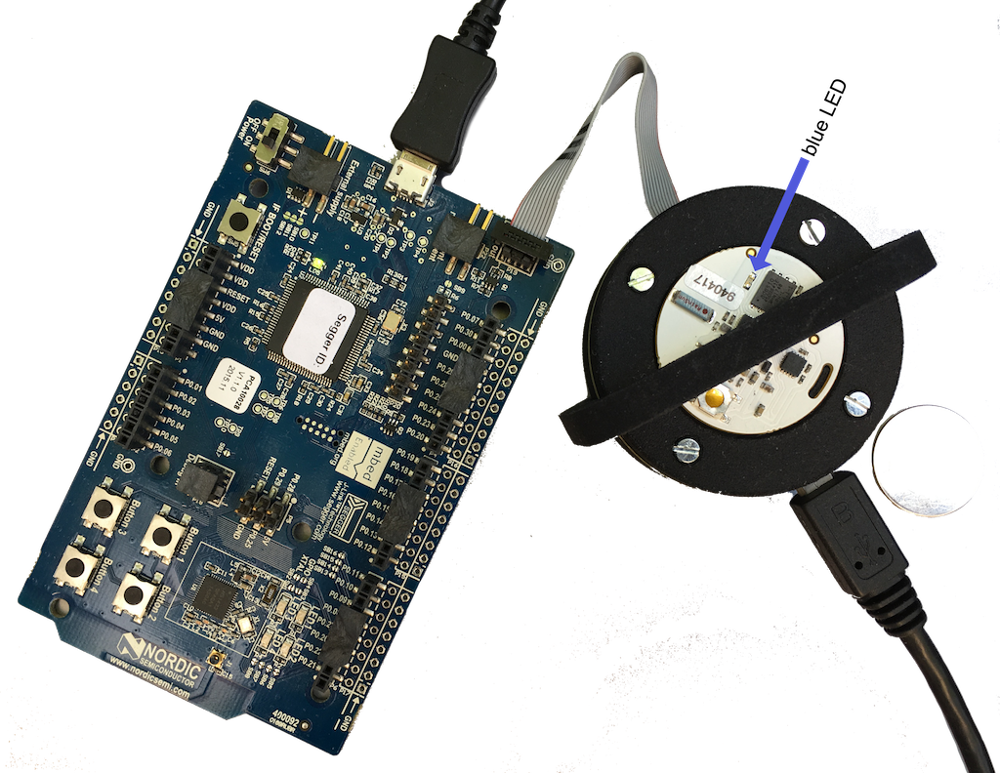

# Updating the OpenBeacon Tag

## Connecting Nordic nRF51-DK development kit and OpenBeacon Programmer

The [OpenBeacon Programmer](https://www.openbeacon.org/device.html) connects with a flat ribbon cable to the nRF51-development board. Please make sure, that the red marking on the flat cable is pointing towards the USB connector of the OpenBeacon Programmer. Use the pins labeled “Debug Out” next to the USB connector to connect the flat ribbon cable to the the nRF51-development board. Both boards, OpenBeacon Programmer and nRF51, use a Micro-USB cable each with your local laptop or computer. Slide the switch next to the USB connector on the nRF51-development board to position “ON”.



You may check both USB connections by running ```lsusb``` on Linux or the command ```system_profiler SPUSBDataType``` in your OS X terminal. It should give you the manufacturer information “FTDI” for the OpenBeacon Programmer and “Segger” for the nRF51-development board.

The connection should pop up as an external USB device labeled “JLINK” in your local file manager or finder.

Remove the battery from the tag you want to flash and place it on the golden flexible pins within the round black frame of the OpenBeacon Programmer. The battery connector should face downwards and the little slit in the tag should align with the corresponding embossment in the round frame. Place the black bracket over tag and programmer to hold both in place or press and hold gently with your hand while flashing the firmware.



## Choosing latest firmware

We provide the [latest firmware release](../../../releases) in our GitHub. Please download the zip file, unpack on your local computer and choose the relevant firmware. You will need at least two different types of firmware: One for marking locations ("marker tag”) and the other for the tags on moving persons/objects ("log tag"). Other firmware for special applications from previous studies are also available.

Select, copy and paste drop the chosen firmware file into your external device “JLINK” within your file manager or finder. The board automatically starts updating the firmware of the tag. The process takes less than a second. The blue LED on the tag lights up for 2 seconds to indicate the successful process and resumes fast blinking afterwards. You may now remove the tag.

When you insert the battery into the tag, the blue LED will light up for 2 seconds and will than continue to blink every 5 seconds. Please make sure to insert the CR2032 batteries just before you hand out the tags to ensure long battery lifetime and only relevant data is stored.
