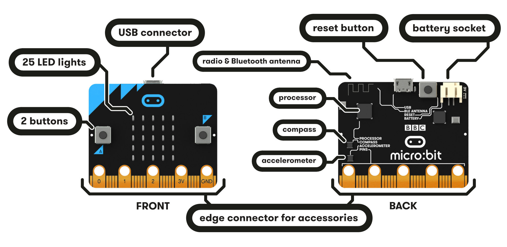
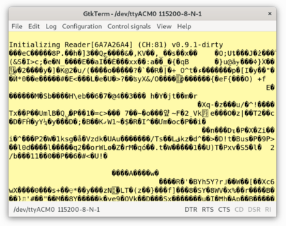
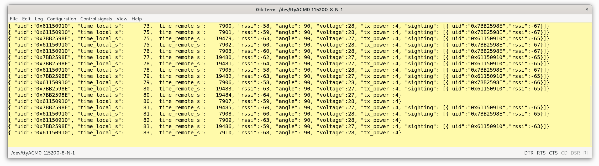

# Turning the BBC micro:bit into an OpenBeacon Reader


## Overview

The [BBC micro:bit](https://microbit.org/guide/features/) is a handheld, programmable micro-computer that can be used for all sorts of cool creations, from robots to musical instruments – the possibilities are endless. You can [buy it at most electronis stores](https://microbit.org/resellers/) and at [Amazon](https://www.amazon.com/s?k=micro%3Abit&ref=bl_dp_s_web_0).

In this tutorial we'll show you how to use the micro:bit as an OpenBeacon reader. You can find the [reader-prox-microbit](../firmware/nRF51/reader-prox-microbit) firmware sources in our github repository. We published a precompiled binary firmware image of reader-prox-microbit to turn your micro:bit into an OpenBeacon USB reader. 


## Install Firmware

We provide the [latest precompiled firmware release](../../../releases) in our GitHub repository. Please download the zip file, unpack on your local computer and choose the reader-prox-microbit.bin firmware. Please connect the micro:bit to your computer using a micro USB cable.

Drag & drop the reader-prox-microbit firmware file onto your external device “MICROBIT” within your file manager or finder. The board automatically starts updating the firmware of the main CPU. The process takes less than a second. The red LED square on the board light up five time to indicate a successful boot and resumes fast blinking afterwards in case of picking up traffic by OpenBeacon tags in proximity.




## Using the micro:bit OpenBeacon USB Reader

For each blink the received data is sent of over USB serial to the host PC. To see the data you need to connect to the USB serial port created by the micro:bit PCB at 115200 Baud transmission speed (Baudrate). The micro:bit starts in compatibility mode and show the received data in binary mode only:



By pressing "Button B" briefly, the device can be switched to human readable text mode:



By pressing "Button A" briefly, the device can be switched back to binary mode.

For every tag in range of the reader, one line of the data below is printed. You can see below, that the 
tag with ID 0x4A1A13B5 is in very close proximity to three other tags with the IDs 0x7EA7D3ED, 0x3DCFB9B4
and 0x1AFF5471. The reader picks up the reporting tag at -82dBm. Additionally  for each of the tags in
sight of the reporting tag, RSSI-values are reported as well (-63dBm, -66dBm, 58dBm).

The tag also reports its angle, battery voltage and its internal time stamp **time_remote_s**
(seconds after battery insertion). The key here is the **time_local_s** field - which represents the time
in seconds receiving this sighting ince starting the micro:bit.

#### Example Output
```JSON
{
	"uid": "0x4A1A13B5",
	"time_local_s": 1535269163,
	"time_remote_s": 567,
	"rssi": -82,
	"angle": 90,
	"voltage": 28,
	"tx_power": 4,
	"sighting": [{
		"uid": "0x7EA7D3ED",
		"rssi": -63
	}, {
		"uid": "0x3DCFB9B4",
		"rssi": -66
	}, {
		"uid": "0x1AFF5471",
		"rssi": -58
	}]
}
```

## Using openbeacon-sniffer host software with the micro:bit

Below you can find a quick example on how to extract live tag data on an Apple MacBook. In case you see errors trying running the commands ```git``` or ```make``` below, you might have to install them first by running ```xcode-select --install```.

> Please note that the software expects the tag to be in its default mode - the binary mode. The packet decryption and decoding is happening in the host software.

For every tag in range of the reader, one line of the data below is printed. You can see below, that the 
tag with ID 0x4A1A13B5 is in very close proximity to three other tags with the IDs 0x7EA7D3ED, 0x3DCFB9B4
and 0x1AFF5471. The reader picks up the reporting tag at -82dBm. Additionally  for each of the tags in
sight of the reporting tag, RSSI-values are reported as well (-63dBm, -66dBm, 58dBm).

The tag also reports its angle, battery voltage and its internal time stamp **time_remote_s**
(seconds after battery insertion). The key here is the **time_local_s** field - which represents the time
receiving this sighting at the host in seconds.
The time unit for the local time is [Unix Epoch Time](https://www.epochconverter.com/) - which is the number of seconds that have elapsed since January 1, 1970 (midnight UTC/GMT).
By combining the local time and the remote tags time, the log files for each tag can be converted into the common local time.

#### Example Usage
```bash
# Download Sources
git clone https://github.com/meriac/openbeacon-ng
# Change into the openbeacon-sniffer host software directory
cd openbeacon-ng/host/openbeacon-sniffer/

# Compile software
make
# gcc -O3 -W -Wall -Werror -I.  -D_THREAD_SAFE -D_REENTRANT  -c -o openbeacon_sniffer.o openbeacon_sniffer.c
# gcc -O3 -W -Wall -Werror -I.  -D_THREAD_SAFE -D_REENTRANT  -c -o crypto.o crypto.c
# gcc -O3 -W -Wall -Werror -I.  -D_THREAD_SAFE -D_REENTRANT openbeacon_sniffer.o crypto.o -o openbeacon_sniffer

# Run software - note that the '*' is automatically expanded to the device name of your
# OpenBeacon programmer. Each had a different name - mine is for example /dev/tty.usbserial-AK0535TL
# The last (and optional) parameter is the optional baud rate setting - in our case 115200 Baud.
./openbeacon_sniffer /dev/tty.usbserial-* 115200
#  opening /dev/ttyACM0 @ 115200 Baud
#  { "uid":"0x4A1A13B5", "time_local_s":1535276483, "time_remote_s":     382, "rssi":-84, "angle": 90, "voltage":2.7, "tx_power":4}
#  { "uid":"0x1AFF5471", "time_local_s":1535276484, "time_remote_s":    7894, "rssi":-71, "angle": 90, "voltage":2.8, "tx_power":4}
#  { "uid":"0x7EA7D3ED", "time_local_s":1535276484, "time_remote_s":    7897, "rssi":-78, "angle": 90, "voltage":2.8, "tx_power":4, "sighting": [{"uid":"0x4A1A13B5","rssi":-66},{"uid":"0x1AFF5471","rssi":-57}]}
#  { "uid":"0x4A1A13B5", "time_local_s":1535276484, "time_remote_s":     383, "rssi":-83, "angle": 90, "voltage":2.8, "tx_power":4}
#  { "uid":"0x7EA7D3ED", "time_local_s":1535276484, "time_remote_s":    7898, "rssi":-82, "angle": 90, "voltage":2.8, "tx_power":4}
#  { "uid":"0x1AFF5471", "time_local_s":1535276485, "time_remote_s":    7895, "rssi":-74, "angle": 90, "voltage":2.8, "tx_power":4, "sighting": [{"uid":"0x4A1
```
For writing the collected tag data into a file, you simply redirect into a log file:
```bash
./openbeacon_sniffer /dev/tty.usbserial-* 115200 >>logfile.json
```
Please note that '>>' keeps on appending to **logfile.json** when you run openbeacon_sniffer multiple
times. This way you can combine data from multiple runs in case you have to replaunch openbeacon_sniffer.
